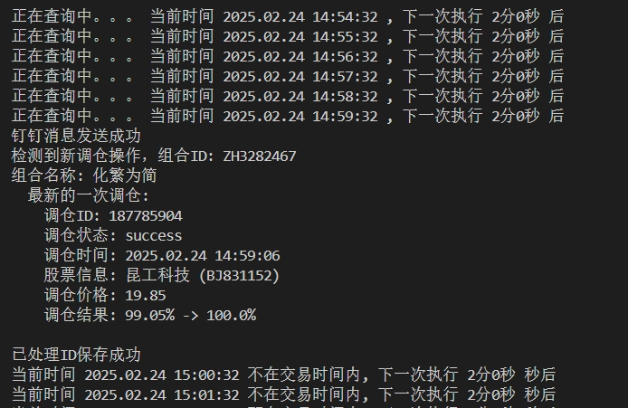
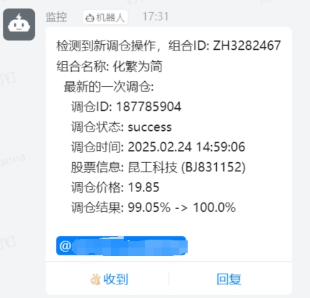

# Snowball Monitor  

Snowball Monitor 是一个用于监控雪球组合调仓操作的自动化程序，它能够在检测到新的调仓操作时，通过钉钉机器人发送通知消息。  

## 特性  

- 使用 [pysnowball](https://github.com/Pa55w0rd/pysnowball) 库访问雪球 API  
- 在交易时间内，定时监控指定雪球组合的调仓操作  
- 通过钉钉机器人发送调仓通知消息，可自行扩展发送到其他通知渠道  
- 支持秒、分钟、小时的时间间隔配置  

## 环境  

- Windows 11  
- Python 3.8  

## 安装  

首先，克隆该仓库到本地：  

```bash  
git clone https://github.com/Pa55w0rd/snowball-monitor.git
```

进入项目目录：

```bash
cd snowball-monitor  
```

安装依赖[pysnowball](https://github.com/Pa55w0rd/pysnowball)：
```bash
git clone https://github.com/Pa55w0rd/pysnowball.git
cd pysnowball
pip isntall .
```

安装其他依赖：

```bash
pip install -r requirements.txt  
```

## 配置
在项目目录下，修改 config.ini 文件，并按照以下格式填写：

```ini
[default]  
cube_ids = ZHxx,ZHxx  
dingtalk_webhook = https://oapi.dingtalk.com/robot/send?access_token=xx  
xq_a_token = xx  
u = xx  
interval_type = seconds  # 可以是 'seconds', 'minutes', 或 'hours'  
interval_value = 30  
at_mobiles = 138xxxxxxxx  
```
- cube_ids: 你要监控的雪球组合ID列表，以逗号分隔
- dingtalk_webhook: 钉钉机器人的Webhook地址
- xq_a_token: 雪球 API 的 token
- u: 雪球 API 的用户标识
- interval_type: 执行间隔的时间类型，可以是 seconds（秒）、minutes（分）或 hours（小时）
- interval_value: 执行间隔的时间值
- at_mobiles: 在钉钉消息中需要@的手机号码列表，以逗号分隔

> 可通过登录网页版雪球，打开开发者工具 - 应用 - cookies 查看 u 和 xq_a_token 的值

## 运行
确保已经配置好 config.ini 文件后，运行程序：

```bash
python monitor.py  
```

程序将会在交易时间内根据配置的间隔时间监控调仓操作，并通过钉钉机器人发送通知消息。

## 效果
终端中显示



钉钉机器人消息（请忽略发送时间，历史消息清空，手动触发了一次）



## 注意事项
- 请确保你的雪球账号已经通过验证，否则无法获取完整数据。
- 请确保钉钉机器人的WebHook地址正确，有效。
- 配置文件中的所有个人信息和Token请妥善保管，避免泄露。
